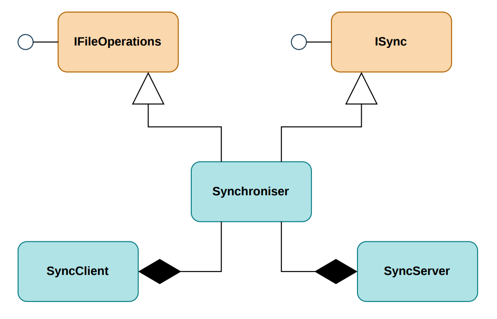

# FileSync Specification

## Requirements

To develop a file synchronization module for the Cop project with the following features:

1. Allow any module (Incident Management, Whiteboard, Cloud, etc.) to share files from its local folder with other cops using a single button click.
2. Synchronize **large files** (images, videos, documents, whiteboard exports) over the LAN. Small structured data such as incident records is stored in the Cloud and is **out of scope**.
3. Transfer only what is needed: new or changed files are pulled, unchanged files are skipped.
4. Never silently lose a cop's work when two cops edit the same file independently.
5. Expose a small, stable API so other modules integrate without knowing anything about sockets, manifests or conflict logic.
6. Report progress, results and conflicts back to the calling module so that it can display them in its own UI.

<br>

---

## Class Diagram



---

## Shared Directory

Every system has one common shared directory, `Root`. FileSync synchronizes everything inside it (created, modified and deleted files and folders) across connected systems.

- Default location: `%LocalAppData%/FileSync/Root` (created automatically).
- Modules may create their own subdirectories inside `Root`:

```text
Root/
├── evidences/       # Incident Management
├── WhiteboardLogs/  # Whiteboard
└── ...
```

Modules do not implement their own save/read/update/delete logic. They use `IFileOperations` and let FileSync handle synchronization.

---

## API

### IFileOperations

All methods take a **relative path** (relative to `Root`).

```csharp
public interface IFileOperations
{
    string GetDirectory();
    bool SaveFile(string relativePath, byte[] content);
    byte[] ReadFile(string relativePath);
    bool UpdateFile(string relativePath, byte[] content);
    bool DeleteFile(string relativePath);
    bool FileExists(string relativePath);
}
```

| Method | Description | On failure |
|---|---|---|
| `GetDirectory()` | Returns the path of `Root` on the current system. | n/a |
| `SaveFile` | Creates a **new** file. Fails if the file already exists. | Returns `false` |
| `ReadFile` | Returns the file contents as `byte[]`. | Throws (e.g. `IOException`) |
| `UpdateFile` | Overwrites an **existing** file. Fails if the file does not exist. | Returns `false` |
| `DeleteFile` | Deletes an existing file. Fails if the file does not exist. | Returns `false` |
| `FileExists` | Returns `true` if the file exists. | Returns `false` |

### ISync

```csharp
public interface ISync
{
    void Synchronise();

    event Action OnSyncComplete;
    event Action<string> OnSyncError;
}
```

| Member | Description |
|---|---|
| `Synchronise()` | Runs the synchronisation process. *Not implemented yet; networking will be added separately.* |
| `OnSyncComplete` | Raised when synchronisation completes successfully. |
| `OnSyncError` | Raised when an error occurs and provides the error message. |

### Rules

- `relativePath` must be non-empty and relative to `Root`. Absolute paths and paths escaping `Root` (e.g. `../`) are rejected.
- File content is passed as `byte[]`, so the entire file is loaded into memory.
- Modules do not trigger synchronization for file changes; the sync engine picks them up.
- Expected file errors (I/O, access, invalid path, unsupported path, security) are caught, reported through `OnSyncError`, and then reflected as `false` (or rethrown for `ReadFile`).

<br>

---

## Example Usage

```csharp
var fileSync = new Synchroniser();
IFileOperations files = fileSync;
ISync sync = fileSync;

// Optional UI events
sync.OnSyncComplete += ShowGreenCheckmark;
sync.OnSyncError += ShowErrorPopup;

// File operations
bool saved   = files.SaveFile("evidences/incident42/photo.png", imageData);
byte[] data  = files.ReadFile("evidences/incident42/photo.png");
bool updated = files.UpdateFile("evidences/incident42/photo.png", newImageData);
bool exists  = files.FileExists("evidences/incident42/photo.png");
bool deleted = files.DeleteFile("evidences/incident42/photo.png");
```

Modules write to the shared directory like a normal drive and only listen to events; FileSync handles network traversal and conflict logic independently.

## Implemented So Far
| Type | Namespace | Responsibility |
|---|---|---|
| `IFileOperations` | `Filesync` | Local file operations on the shared `Root` directory. |
| `ISync` | `Filesync` | Synchronisation trigger and result events. |
| `Synchroniser` | `Filesync` | Implements both interfaces. |