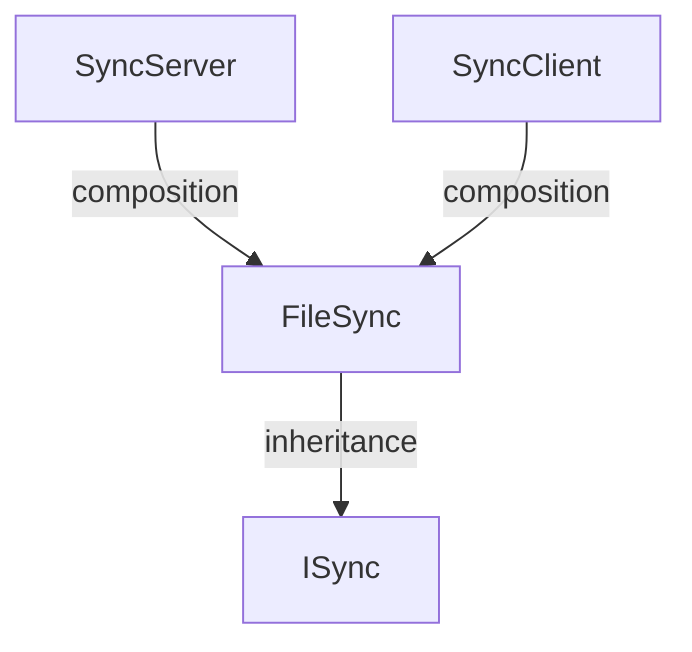

# FileSync Specification

## Requirements

To develop a file synchronization module for the Cop project with the following features:

1. Allow any module (Incident Management, Whiteboard, Cloud, etc.) to share files from its local folder with other cops using a single button click.
2. Synchronize **large files** (images, videos, documents, whiteboard exports) over the LAN. Small structured data such as incident records is stored in the Cloud and is **out of scope**.
3. Transfer only what is needed: new or changed files are pulled, unchanged files are skipped.
4. Never silently lose a cop's work when two cops edit the same file independently.
5. Expose a small, stable API so other modules integrate without knowing anything about sockets, manifests or conflict logic.
6. Report progress, results and conflicts back to the calling module so that it can display them in its own UI.

<br>

---

## Basic Class Diagram 



---


## Interface for Other Modules to Use

FileSync is a low-level module that does not directly interact with any other modules. It exposes a simple interface (`ISync`) through which modules can get the common shared directory present on every system, and save, read, update and delete files inside it.

All modules are free to create their own subdirectories within this shared directory. For example:

```text
Root/
├── evidences/       # Incident Management
├── WhiteboardLogs/  # Whiteboard
└── ...
```

Modules do not need to implement their own save, read, update or delete functions. FileSync provides these through the `ISync` interface, and each module simply uses them to manage the files within its directory under `Root`.

The FileSync module works independently and synchronizes all files and folders within `Root` across the connected systems. This includes files and folders that are created, modified, or deleted.

---

## FileSync API

FileSync provides a simple interface for other modules to access the common shared directory and to save, read, update and delete files inside it.

All file methods take a **relative path** (relative to `Root`). FileSync combines it with `GetDirectory()` internally, so modules never build full paths or touch the sync logic themselves.

```csharp
public interface ISync
{
    // Directory
    string GetDirectory();

    // File operations (relativePath is relative to GetDirectory())
    void SaveFile(string relativePath, Stream content);
    void SaveFile(string relativePath, byte[] content);

    Stream ReadFile(string relativePath);
    byte[] ReadAllBytes(string relativePath);

    void UpdateFile(string relativePath, Stream content);
    void UpdateFile(string relativePath, byte[] content);

    void DeleteFile(string relativePath);

    bool FileExists(string relativePath);

}
```

### Method Description

| Method | Description |
|---|---|
| `GetDirectory()` | Returns the path of the shared `Root` directory on the current system. |
| `SaveFile(relativePath, content)` | Creates a new file at `Root/relativePath`. Missing subfolders are created automatically. Throws if the file already exists (use `UpdateFile`). |
| `ReadFile(relativePath)` | Returns a read-only `Stream` of the file. Preferred for large files. |
| `ReadAllBytes(relativePath)` | Returns the whole file as `byte[]`. For small files only. |
| `UpdateFile(relativePath, content)` | Overwrites an existing file at `Root/relativePath`. Throws if the file does not exist (use `SaveFile`). |
| `DeleteFile(relativePath)` | Deletes the file at `Root/relativePath`. The deletion is synchronized to other systems. |
| `FileExists(relativePath)` | Returns `true` if the file exists in the shared directory. |

### Rules

- `relativePath` must be relative. Absolute paths and paths escaping `Root` (e.g. `../`) are rejected with an `ArgumentException`.
- `Stream` overloads are recommended for large files (images, videos, whiteboard exports) to avoid loading them fully into memory.
- Any save, update or delete is automatically picked up by FileSync's sync engine. Modules never trigger sync themselves.

### Example Usage by Another Module

`GetDirectory()` returns the path to the common shared directory on the current system.

Other modules use this directory, together with the file methods above, to create and manage their own files and folders.

For example:

```csharp
ISync fileSync = new FileSync();

string rootDirectory = fileSync.GetDirectory();

string evidenceDirectory =
    Path.Combine(rootDirectory, "evidences");
```

Saving, reading, updating and deleting files:

```csharp
// Save
byte[] imageData = File.ReadAllBytes(localImagePath);
fileSync.SaveFile("evidences/incident42/photo.png", imageData);

// Read
using Stream stream = fileSync.ReadFile("evidences/incident42/photo.png");

// Update
fileSync.UpdateFile("evidences/incident42/photo.png", newImageData);

// Delete
fileSync.DeleteFile("evidences/incident42/photo.png");
```

**NOTE** : *Modules use the `ISync` file methods to manage their files inside the shared directory. FileSync handles the synchronization of the contents of the shared directory between systems.*

---

## UI Updates (Event Subscription)

To satisfy Requirement #6 (Reporting progress/results back to the calling module's UI), the FileSync module provides optional event subscriptions. 

Other modules (like Whiteboard or Incident Management) do not command the sync to start. However, if they want to display a "Green Checkmark" or an "Error Popup" on their UI, they can passively tune in to FileSync's events. These events are part of the `ISync` interface:

```csharp
public interface ISync
{
 
    // Along with these methords GetDirectory, SaveFile, ReadFile, DeleteFile, UpdateFile, FileExists 

    // Optional UI Events for Requirement #6
    event Action OnSyncComplete;
    event Action<string> OnSyncError;
}
```

### Example Usage by Another Module

```csharp
// 1. They subscribe their UI functions to our events
fileSync.OnSyncComplete += ShowGreenCheckmark;
fileSync.OnSyncError += ShowErrorPopup;

// 2. The UI Functions (Triggered automatically by FileSync's network engine)
void ShowGreenCheckmark()
{
    // Draw a green checkmark on the screen
}

void ShowErrorPopup(string errorMessage)
{
    // Draw a red box with the exact error string (e.g., "Network disconnected")
}
```

This guarantees **Separation of Concerns**. The sub-modules act like they are writing to a normal hard drive and just listen to events, while FileSync independently handles all network traversal and conflict logic.