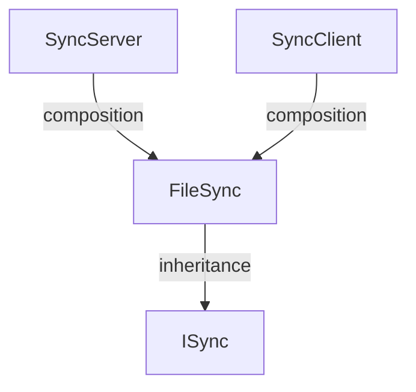

# FileSync Specification

## Requirements

To develop a file synchronization module for the Cop project with the following features:

1. Allow any module (Incident Management, Whiteboard, Cloud, etc.) to share files from its local folder with other cops using a single button click.
2. Synchronize **large files** (images, videos, documents, whiteboard exports) over the LAN. Small structured data such as incident records is stored in the Cloud and is **out of scope**.
3. Transfer only what is needed: new or changed files are pulled, unchanged files are skipped.
4. Never silently lose a cop's work when two cops edit the same file independently.
5. Expose a small, stable API so other modules integrate without knowing anything about sockets, manifests or conflict logic.
6. Report progress, results and conflicts back to the calling module so that it can display them in its own UI.

<br>

---

## Basic Class Diagram 



---


## Interface for Other Modules to Use

FileSync is a low-level module that does not directly interact with any other modules. It exposes only one method, `GetDirectory()`, which returns the path to the common shared directory present on every system.

All modules are free to create their own subdirectories within this shared directory. For example:

```text
Root/
├── evidences/       # Incident Management
├── WhiteboardLogs/  # Whiteboard
└── ...
```

It is the responsibility of each respective module to read, write, save, modify, and delete files within its directory under `Root`.

The FileSync module works independently and synchronizes all files and folders within `Root` across the connected systems. This includes files and folders that are created, modified, or deleted.

---

## FileSync API

FileSync provides a simple interface for other modules to access the common shared directory.

```csharp
public interface ISync
{
    string GetDirectory();
}
```

`GetDirectory()` returns the path to the common shared directory on the current system.

Other modules can use this directory to create and manage their own files and folders.

For example:

```csharp
ISync fileSync = new FileSync();

string rootDirectory = fileSync.GetDirectory();

string evidenceDirectory =
    Path.Combine(rootDirectory, "evidences");
```

**NOTE** : *Each module is responsible for managing its own files inside the shared directory. FileSync handles the synchronization of the contents of the shared directory between systems.*

---

## UI Updates (Event Subscription)

To satisfy Requirement #6 (Reporting progress/results back to the calling module's UI), the FileSync module provides optional event subscriptions. 

Other modules (like Whiteboard or Incident Management) do not command the sync to start. However, if they want to display a "Green Checkmark" or an "Error Popup" on their UI, they can passively tune in to FileSync's events.

```csharp
public interface ISync
{
    string GetDirectory();

    // Optional UI Events for Requirement #6
    event Action OnSyncComplete;
    event Action<string> OnSyncError;
}
```

### Example Usage by Another Module

```csharp
// 1. They subscribe their UI functions to our events
fileSync.OnSyncComplete += ShowGreenCheckmark;
fileSync.OnSyncError += ShowErrorPopup;

// 2. The UI Functions (Triggered automatically by FileSync's network engine)
void ShowGreenCheckmark()
{
    // Draw a green checkmark on the screen
}

void ShowErrorPopup(string errorMessage)
{
    // Draw a red box with the exact error string (e.g., "Network disconnected")
}
```

This guarantees **Separation of Concerns**. The sub-modules act like they are writing to a normal hard drive and just listen to events, while FileSync independently handles all network traversal and conflict logic.
