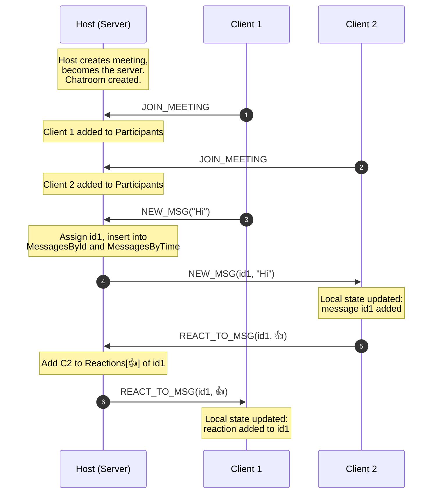

# Architecture

Architecture for the chat module.

## Data structures and classes

> [!NOTE]
> In the subsections under this section, the class definitions only include
> attributes (and not methods). This is because these sections are meant to
> highlight the data structure aspect of the classes. The [methods
> section](#methods-and-interfaces) covers the functionality aspects.

### `ChatMessage`

A chat message is the fundamental building block of our module. It consists of
a textual message (with emojis, possibly), a timestamp to denote when it was
sent, the sender's name, etc.

The following class represents a basic chat message:

```cs
public class ChatMessage
{
    // When the message was sent.
    public DateTimeOffset Timestamp { get; init; }

    // Name of the sender.
    public required string SenderName { get; init; }

    // Message content.
    public string Content { get; set; } = "";

    // Number of times the message's content has been edited.
    public int EditCount { get; set; };

    // The user who deleted the message (if any).
    public string? DeletedByUser { get; set; }

    // ID of the message that this one is a reply to (if any).
    public Guid? ParentMessageId;

    // Dictionary of emojis (their unicode value) and users who reacted with that emoji.
    public Dictionary<string, HashSet<string>> Reactions { get; } = new();
}
```

### `ChatMessageThreaded`

The previous class `ChatMessage` represents basic chat messages. Such messages
have no support for threading. So, we introduce a new class
`ChatMessageWithThreads` to represent chat messages from which threads can
arise.

Here is the `ChatMessageWithThreads` class:

```cs
public class ChatMessageWithThreads : ChatMessage
{
    // Two representations of messages in the associated thread.
    public readonly Dictionary<Guid, ChatMessage> ThreadById = new();
    public readonly SortedDictionary<(DateTimeOffset, Guid), ChatMessage> ThreadByTime = new();
}
```

> [!NOTE]
> The reason we have two structures for storing messages:
> - **Lookup by id:** `ThreadById` is used for $O(1)$ lookup of messages, keyed
>   by their message ID.
> - **Sorting by timestamp** `ThreadByTime` is used for maintaing an order of
>   messages with respect to the time they were sent.
>
> For more details, check out the [design decisions](#two-data-structures)
> section on this.

> [!NOTE]
> Observe that the `Thread` attribute is a list of `ChatMessage` values
> (**not** `ChatMessageWithThreads` values), which is how we implement the fact
> that threading can only be done at one level -- the main
> [chatroom](#chatroom) will have messages from which threads can arise, but
> the messages inside the thread cannot be used to generate another thread.

### `Chatroom`

A chatroom is where the conversations take place.

The following class represents our chatrooms:

```cs
public class Chatroom
{
    public string RoomName { get; set; }
    public string HostName { get; set; }
    public HashSet<string> Participants { get; } = new();

    private readonly Dictionary<Guid, ChatMessageWithThreads> _byId = new();
    private readonly SortedDictionary<(DateTimeOffset, Guid), ChatMessageWithThreads> _byTime = new();
}
```

> [!NOTE]
> The reason for two data structures for storing messages here is the same as
> that for `ChatMessageWithThreads`.
>
> For more details, check out the [design decisions](#two-data-structures)
> section on this.

Please note the following:

- Whenever a meeting is created, a chatroom for that meeting with is
initialized.
- Initially, the chatroom only has the host as a participant.
- As users join the meeting, they are added to this chatroom as participants.

## Methods and interfaces

This section contains the methods being provided to interact with the chat
module.

### `IChatMessage`

```cs
interface IChatMessage
{
    // Editing and deleting messages.
    public bool IsDeleted { get; }
    public void Edit(string newContent);
    public void Delete(string deleter);

    // Reactions.
    public bool AddReaction(string emoji, string user);
    public bool RemoveReaction(string emoji, string user);
}
```

### `IChatMessageWithThreads`

```cs
interface IChatMessageWithThreads : IChatMessage
{
    // Add message to the corresponding thread.
    public void AddMessageToThread(ChatMessage reply);
}
```

### `IChatroom`

Here is the interface for the `Chatroom` class.

```cs
enum RoomResult { Ok, NotFound, Forbidden }

interface IChatroom
{
    // Participants.
    bool AddParticipant(string name);
    bool RemoveParticipant(string name);

    // Messages.
    Guid AddMessage(ChatMessage message);
    bool TryGetMessage(Guid id, out ChatMessage message);

    // Editing and deleting messages.
    RoomResult EditMessage(Guid id, string newContent, string editor);
    RoomResult DeleteMessage(Guid id, string deleter);

    // Reactions.
    RoomResult AddReaction(Guid id, string emoji, string user);
    RoomResult RemoveReaction(Guid id, string emoji, string user);
}
```

Here is the meaning of values of the `RoomResult` enum:

| Value | Meaning |
|-|-|
| `Ok` | Everything was successful |
| `NotFound` | Invalid message ID -- such a message was not found |
| `Forbidden` | The requester did not have the appropriate permissions |

## Architecture

### Overview

Consider the context:

- A user starts (the _host_) a meeting and his device becomes the _server_.
- A chatroom is initialized on the server with the host being the sole
participant, initially.
- As users join the meeting, they join the chatroom and a copy of the chatroom
object is initialized on their devices as well.
- The initial chatroom's message content (in both of the data structures) is
empty.

### Control flow

The idea is to have a _version_ of a `Chatroom` object on all devices -- the
server as well as all of the clients. Any of these devices can perform some
operations, which will go through the server, and the server propagates these
updates to all the participants after updating its internal state. Each of the
clients, once they receive messages propagated by the server update their
internal state as well.

The sequence diagram below demonstrates the same:



### Operations

As the diagram in the section above showed, there are some "messages" that the
participants send to the server for every operation that they want to perform
with the chatroom, and the server further "propagates" these.

We have enumerated these operations. The following is a list of operations that
the clients can send to the server, along with the information encapsulated in
them. These have been divided into thread and non-thread operations.

- Non-threaded versions (in the main chatroom):
    - Send new message
        - `ChatMessageWithThreads` object
    - Edit message
        - Message ID
        - New content
        - The user attempting the edit
    - Delete message
        - Message ID
        - The user attempting the deletion
    - Add reaction to message
        - Message ID
        - Reaction emoji
        - User attempting to add reaction
    - Remove reaction from message
        - Message ID
        - Reaction emoji
        - User attempting to remove reaction
- Threaded versions (in a particular thread):
    - Send new message
        - Parent message ID
        - `ChatMessageWithThreads` object
    - Edit message
        - Parent message ID
        - Message ID
        - New content
        - The user attempting the edit
    - Delete message
        - Parent message ID
        - Message ID
        - The user attempting the deletion
    - Add reaction to message
        - Parent message ID
        - Message ID
        - Reaction emoji
        - User attempting to add reaction
    - Remove reaction from message
        - Parent message ID
        - Message ID
        - Reaction emoji
        - User attempting to remove reaction

> [!NOTE]
> The threaded version of operations have exactly one additional argument
> compared to the non-threaded operations -- the parent message's ID.

The following classes capture the same:

```cs
public abstract record ChatRequest;

public sealed record SendMainMessage(ChatMessageWithThreads Message, Guid? ParentMessageId) : ChatRequest;

public sealed record EditMessage(Guid MessageId, string NewContent, string EditorName, Guid? ParentMessageId) : ChatRequest;

public sealed record DeleteMessage(Guid MessageId, string DeleterName, Guid? ParentMessageId) : ChatRequest;

public sealed record AddReaction(Guid MessageId, string Emoji, string ReactorName, Guid? ParentMessageId) : ChatRequest;

public sealed record RemoveReaction(Guid MessageId, string Emoji, string ReactorName, Guid? ParentMessageId) : ChatRequest;`
```

> [!NOTE]
> Even though we have a total of 10 operations -- 5 threaded and 5
> non-threaded, it suffices to only have 5 records overall, because the last
> parameter of each of them (`Guid? ParentMessageId`) being `null` denotes the
> non-threaded variant, and the parameter being non-`null` denotes a threaded
> variant where the value of the parameter is the thread's parent message's ID.


> [!WARNING]
> The sections below need to be updated.


### Implementation details

- How the server maintains a list of operations/deltas
- How it maintains state of every client
- How it iterates over that and broadcasts things to every client

## Threads

how many threads (roughly), for what, etc.

## Design decisions

### Two data structures

### Polling vs broadcast

points:
- detecting disconnected users

pros and cons, etc.

> [!WARNING]
> EXPLICIT FAIL-TO-SEND REPORTING

