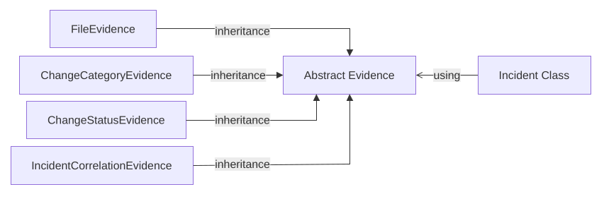

# Incident Management Module

## Requirements

To develop an incident management module with the following features:

1. Allow cops to store/log incidents.
2. Incidents contain title, description, evidence (image, video, documents).
3. Allow cops to update incidents.
4. Incidents can be filtered/searched.
5. Incidents can be Correlated with other incidents when they are related. The incidents to correlate with the current incident can be manually be searched or AI assisted.

## Architecture and Design

### Incident

The `Incident` class contains the following:

| Field                | Type             | Description                                     |
| -------------------- | ---------------- | ----------------------------------------------- |
| **ID**               | `Guid`           | Unique identifier for the `Incident`            |
| **Title**            | `string`         | Title of the `Incident`                         |
| **Description**      | `string`         | Description of the `Incident`                   |
| **Status**           | `enum`           | `{ Reported, InProgress, Resolved }`            |
| **Category**         | `enum`           | `{ DrunkDriving, Theft, Accident }`             |
| **Severity**         | `enum`           | `{ Low, Medium, High, Critical }`               |
| **CreationTime**     | `Datetime`       | Time at which the `Incident` was created        |
| **UpdateTime**       | `Datetime`       | Time at which the `Incident` was last updated   |
| **Evidences**        | `List<Evidence>` | List of evidence associated with the `Incident` |
| **Changes**          | `List<IChange>`  | List of changes associated with the `Incident`  |
| **Edges**            | `List<Guid>`     | Adjacency list of `Incident` ID                 |
|**CorrelatedIncidents**| `List<Guid>`    | List of `Incidents` which are correlated to the give incident |
| **IncidentLocation** | Location         | Address of location of `Incident`               |

**Note:** All `Incident` will be stored in a single XML file during development before integration with cloud.
### Incident APIs

```csharp
public record IncidentLocation(Double Latitude, Double Longitude, String? Address);

public class IncidentFilter
{
	public string? Title { get; set; }
    public IncidentStatus? Status { get; set; }
    public IncidentCategory? Category { get; set; }
    public IncidentSeverity? Severity { get; set; }
    public DateTime? Since { get; set; }
    public IncidentLocation? location { get; set; }
}

public class CreateIncidentRequest
{
    public string Title { get; set; }
    public string Description { get; set; }
    public IncidentStatus Status { get; set; }
    public IncidentCategory Category { get; set; }
    public IncidentSeverity Severity { get; set; }
    public List<Evidence> Evidences { get; set; }
    public IncidentLocation location { get; set; }
}

public interface IIncidentController
{
    List<Incident> GetAll(IncidentFilter filter);
    Incident? GetById(Guid id);
    bool Add(CreateIncidentRequest request);
    bool AddEvidence(Guid id, Evidence evidence);
    bool UpdateStatus(Guid id, IncidentStatus newStatus);
    bool UpdateCategory(Guid id, IncidentCategory newCategory);
    bool UpdateSeverity(Guid id, IncidentSeverity newSeverity);
    bool UpdateLocation(Guid id, IncidentLocation location);
    bool CorrelateIncident(Guid id1, Guid id2);
}

public interface IIncidentService
{
    Task<bool> CreateAsync(CreateIncidentRequest request);
    Task<List<Incident>> GetAllIncident(IncidentFilter filter);
    Task<Incident> GetIncidentById(Guid id);
    Task<bool> UpdateStatusAsync(Guid id, IncidentStatus newStatus);
    Task<bool> UpdateCategoryAsync(Guid id, IncidentCategory newCategroy);
    Task<bool> UpdateSeverityAsync(Guid id, IncidentSeverity newSeverity);
    Task<bool> UpdateLocationAsync(Guid id, IncidentLocation newLocation);
    Task<bool> CorrelateIncidentAsync(Guid id1, Guid id2);
}

```

### Evidence

The `Evidence` class contains the following:

| Field           | Type       | Description                                                           |
| --------------- | ---------- | --------------------------------------------------------------------- |
| **Description** | `string`   | Description of the `Evidence`                                         |
| **FilePath**    | `string?`  | Path to the file. Supported file types: images, videos and documents. |
| **UploadTime**  | `Datetime` | Time at which this `Evidence` was uploaded                            |
| **UploadedBy**  | `Guid`     | ID of the user who added this as `Evidence`                           |

**Note:** `Evidence` will be not be allowed any update/deletion associated with an `Incident`
### IChange

The `IChange` interface contains the following:

| Field          | Type       | Description                                      |
| -------------- | ---------- | ------------------------------------------------ |
| **OldValue**   | `T`        | Previous value of the property before the change |
| **NewValue**   | `T`        | New value of the property after the change       |
| **UploadTime** | `DateTime` | Time at which the change was recorded            |
| **UploadedBy** | `Guid`     | ID of the user who made the change               |


- **ChangeCategory:** It is a change in `Incident` specifying about the change in `Category` of the incident.
- **ChangeStatus**: It is a change in  `Incident` specifying about the change in `Status` of the incident.
- **ChangeSeverity**: It is a change in  `Incident` specifying about the change in `Severity` of the incident.
- **ChangeIncidentLocation**: It is a change in  `Incident` specifying about the change in `IncidentLocation` of the incident.


### IncidentCorrelation
`IncidentCorrelation` is a separate entity representing a correlation between two incidents. It is neither an implementation of `IChange<T>` nor a type of `Evidence`.

| Field            | Type       | Description                                |
| ---------------- | ---------- | ------------------------------------------ |
| **ID**           | `Guid`     | Unique identifier for the correlation      |
| **IncidentId1**  | `Guid`     | ID of the first incident                   |
| **IncidentId2**  | `Guid`     | ID of the second incident                  |
| **CreationTime** | `DateTime` | Time at which the correlation was created  |
| **CreatedBy**    | `Guid`     | ID of the user who created the correlation |


**Note:** `UpdateTime` in `Incident`will be updated whenever a `Change` or `Evidence` is made to the `Incident`.

**Note:** `Incident` will be displayed as a timeline of `Evidences` + `Changes` in the UI.

```md
Incident Created by Cop X
    |
    +-- Status changed from InProgress to Closed by Cop Y
    |
    +-- Category changed from Accident to Murder by Cop X
    |
    +-- Severity changed from Low to High
    |
    +-- Incident B is correaled with this incident.
```

### Class Diagram $\color{red}{\text{Needs to be updated}}$



### Correlation Approach

Update from Union-Find

- Union-Find will not be able to handle deletion. To alter this we propose an undirected graph G(V,E) where V = set of `Incident` ID and  E = set of edges representing correlation. Each vertex in a connected component is correlated. This graph may be displayed to the cop to see.
- Each `Incident` will store `Edges` field which is an adjacency list for current `Incident`. The beauty is that since G(V,E) is an undirected graph, every vertex can reach every other vertex in a connected component. This would not be possible in a directed graph. Therefore, a graph search algorithm like Breadth First Search would be able to find all connected components in G (V,E).
- Adding a correlation/edge between Incident A and Incident B involves:
   - If `Incident` A and `Incident` B are in the same connected component, then do nothing.
   - Else add edge between `Incident` A and `Incident` B i.e. appending the other vertex `ID` to the `Edges` field.
- Deletion of correlation/edge between `Incident` A and `Incident` B involves:
   - Checking whether `Incident` A and `Incident` B are in the same connected component, if not do nothing.
   - Else a particular edge should be chosen by the cop to delete between the path from `Incident` A to `Incident` B . Preferably show in the **UI** to choose by the user.

### Prototype Code

#### Incident $\color{red}{\text{Needs to be updated}}$

```csharp
public enum IncidentStatus { Reported, InProgress, Resolved, .. }

public enum IncidentCategory { DrunkDriving, Theft, Accident, ..}

public enum IncidentSeverity { Low, Medium, High, Critical ,..}

public class Incident {

    private Guid id;
    private string title;
    private string description;
    private IncidentStatus status;
    private IncidentCategory category;
    private IncidentSeverity severity;
    private DateTime creationTime;
    private DateTime updateTime;
    private List<Evidence> evidence;
    private List<IChanges> changes;
    private List<Guid> edges;
    private location incidentLocations;
    private List<Guid> correlatedIncidents;

    public Incident(string title ,string description,IncidentCategory category) {
        this.id = Guid.NewGuid();
        this.title = title;
        this.description = description;
        this.status = IncidentStatus.Pending;
        this.category = category;
        this.creationTime = DateTime.Now;
        this.updateTime = this.creationTime;
        this.evidence = new List<Evidence>();
        this.changes  = new List<IChanges>();
        this.correlatedIncidents = new List<Guid>();
    }

    public Guid GetId() {
        return id;
    }

    public string GetTitle() {
        return title;
    }

    public string GetDescription() {
        return description;
    }

    public IncidentStatus GetStatus() {
        return status;
    }

    public IncidentCategory GetCategory() {
        return category;
    }

    public IncidentSeverity GetSeverity() {
        return severity;
    }

    public DateTime GetCreationTime() {
        return creationTime;
    }

    public DateTime GetUpdateTime() {
        return updateTime;
    }

    public List<Evidence> GetEvidence() {
        return evidence;
    }

    public List<IChanges> GetChanges(){
        return changes;
    }

    public List<Guid> GetCorrelations() {
        return correlatedIncidents;
    }

    public location GetLocation() {
        return incidentLocation;
    }
}
```

#### Evidence

```csharp
public sealed class Evidence {

    private string description;
    private string? filePath;
    private DateTime uploadTime;
    private Guid uploadedBy;

    public string GetDescription() {
        return description;
    }

    public string? GetFilePath() {
        return filePath;
    }

    public DateTime GetUploadTime() {
        return uploadTime;
    }

    public Guid GetUploadedBy() {
        return uploadedBy;
    }
}
```

#### IChange

Generics `<T>` provides compile-time safety over `object`

```csharp
public interface IChange<T> {
	T OldValue { get; };
	T NewValue { get; };
	DateTime UploadTime { get; };
	Guid UploadedBy { get; };
}
```

#### CategoryChange

```csharp
public class CategoryChange : IChange<IncidentCategory> {
	public OldValue { get; }
	public NewValue { get; }
	public DateTime UploadTime { get; };
	public Guid UploadedBy { get; };

	public CategoryChange(IncidentCategory OldValue, IncidentCategory NewValue, DateTime UploadTime, Guid UploadedBy){
		this.OldValue = OldValue;
		this.NewValue = NewValue;
		this.UploadTime = UploadTime;
		this.UploadedBy = UploadBy;
	}
}
```

#### StatusChange

```csharp
public class StatusChange : IChange<IncidentStatus> {
	public IncidentStatus OldValue { get; }
	public IncidentStatus NewValue { get; }
	public DateTime UploadTime { get; };
	public Guid UploadedBy { get; };

	public StatusChange(IncidentStatus OldValue, IncidentStatus NewValue, DateTime UploadTime, Guid UploadedBy){
		this.OldValue = OldValue;
		this.NewValue = NewValue;
		this.UploadTime = UploadTime;
		this.UploadedBy = UploadBy;
	}
}
```

Similarly other changes ...


#### IncidentCorrelation $

```csharp
public class IncidentCorrelation {

    public Guid Id { get; }
    public Guid IncidentId1 { get; }
    public Guid IncidentId2 { get; }
    public DateTime CreationTime { get; }
    public Guid CreatedBy { get; }

    public IncidentCorrelation(Guid incidentId1,Guid incidentId2,DateTime creationTime,Guid createdBy){
        Id = Guid.NewGuid();
        IncidentId1 = incidentId1;
        IncidentId2 = incidentId2;
        CreationTime = creationTime;
        CreatedBy = createdBy;
    }
}
```

### Unique ID Generator

Since incidents can be created by multiple devices at the same time in our LAN-based system, we need a way to generate **unique IDs independently on each device**. There is no central server responsible for assigning IDs, so the IDs must be generated locally without requiring coordination between devices.

### Solution

We will use a **GUID (Globally Unique Identifier)** as the incident ID. GUIDs are 128-bit identifiers that can be generated independently by each device. This allows multiple devices to create incident IDs at the same time without requiring a central ID generator.

 **Collision Probability:** A GUID is a 128-bit identifier, providing approximately $2^{122}$ possible values when accounting for the bits reserved by the UUID format. The number of possible GUIDs is therefore extremely large, making the probability of two independently generated GUIDs colliding negligibly small for our system, even when multiple devices generate IDs simultaneously.

### C# Implementation

No external library is required because GUID generation is built into C#/.NET.

For example:

```csharp
Guid incidentId = Guid.NewGuid();

Console.WriteLine(incidentId);
```

The generated GUID can then be stored as the incident's unique identifier:

```csharp
public class Incident
{
    public Guid Id { get; }

    public Incident()
    {
        Id = Guid.NewGuid();
    }
}
```

This allows every device connected to the LAN to generate incident IDs locally while maintaining a sufficiently low probability of ID collisions across the entire system.

### Prototype XML

#### `Incident` XML

An example of the `Incident`s stored in XML format is shown below:

```xml
<IncidentList>

    <Incident>

        <Id>...</Id>
        <Title>...</Title>
        <Description>...</Description>
        <Status>...</Status>
        <Category>...</Category>
        <CreationTime>...</CreationTime>
        <UpdateTime>...</UpdateTime>
        <CorrelationRepresentative>...</CorrelationRepresentative>

        <EvidenceList>

            <FileEvidence>
                <Description>...</Description>
                <FilePath>...</FilePath>
                <UploadTime>...</UploadTime>
                <UploadedBy>...</UploadedBy>
            </FileEvidence>

            <CategoryChangeEvidence>
                <Description>...</Description>
                <UploadTime>...</UploadTime>
                <UploadedBy>...</UploadedBy>
            </CategoryChangeEvidence>

            <StatusChangeEvidence>
                <Description>...</Description>
                <UploadTime>...</UploadTime>
                <UploadedBy>...</UploadedBy>
            </StatusChangeEvidence>

            <IncidentCorrelationEvidence>
                <Description>...</Description>
                <UploadTime>...</UploadTime>
                <UploadedBy>...</UploadedBy>
            </IncidentCorrelationEvidence>

        </EvidenceList>

    </Incident>

</IncidentList>
```
