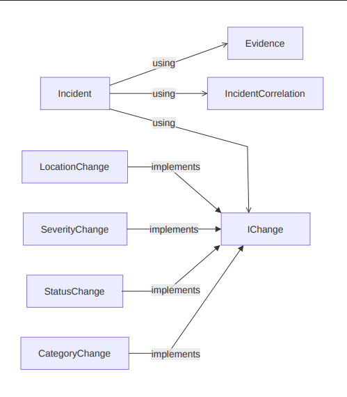

# Incident Management Module

## Requirements

To develop an incident management module with the following features:

1. Allow cops to store/log incidents.
2. Incidents contain title, description, evidence (image, video, documents).
3. Allow cops to update incidents.
4. Incidents can be filtered/searched.
5. Incidents can be Correlated with other incidents when they are related. The incidents to correlate with the current incident can be manually be searched or AI assisted.

## Architecture and Design

### Incident

The `Incident` class contains the following:

| Field                   | Type                        | Description                                                   |
| ----------------------- | --------------------------- | ------------------------------------------------------------- |
| **Id**                  | `Guid`                      | Unique identifier for the `Incident`                          |
| **Title**               | `string`                    | Title of the `Incident`                                       |
| **Description**         | `string`                    | Description of the `Incident`                                 |
| **CreatedBy**           | `Guid`                      | Id of cop who created `Incident`                              |
| **Status**              | `enum`                      | `{ Reported, InProgress, Resolved }`                          |
| **Category**            | `enum`                      | `{ DrunkDriving, Theft, Accident }`                           |
| **Severity**            | `enum`                      | `{ Low, Medium, High, Critical }`                             |
| **CreationTime**        | `Datetime`                  | Time at which the `Incident` was created                      |
| **UpdateTime**          | `Datetime`                  | Time at which the `Incident` was last updated                 |
| **Evidences**           | `List<Evidence>`            | List of evidence associated with the `Incident`               |
| **Changes**             | `List<IChange>`             | List of changes associated with the `Incident`                |
| **Edges**               | `List<Guid>`                | Adjacency list of `Incident` ID                               |
| **CorrelatedIncidents** | `List<IncidentCorrelation>` | List of `Incidents` which are correlated to the give incident |
| **Location**            | `IncidentLocation`          | Address of location of `Incident`                             |

**Note:** All `Incident` will be stored in a single XML file during development before integration with cloud.

### Incident APIs

```csharp
public record IncidentLocation(Double Latitude, Double Longitude, String? Address);

public record IncidentLocationFilter(Double Latitude, Double Longitude, String? Address, Double? Radius);

public class IncidentFilter
{
	public string? Title { get; set; } /* Regex applied on title of incident*/
    public IncidentStatus? Status { get; set; }
    public IncidentCategory? Category { get; set; }
    public IncidentSeverity? Severity { get; set; }
    public DateTime? FromDateTime { get; set; }
    public DateTime? ToDateTime { get; set; }
    public Guid? CreatedBy { get; set; }
    public IncidentLocationFilter? location { get; set; }
}

public class CreateIncidentRequest
{
    public string Title { get; set; }
    public string Description { get; set; }
    public IncidentStatus Status { get; set; }
    public IncidentCategory Category { get; set; }
    public IncidentSeverity Severity { get; set; }
    public List<Evidence> Evidences { get; set; }
    public IncidentLocation location { get; set; }
}

public interface IIncidentController
{
    List<Incident> GetAll(IncidentFilter filter);
    List<Incident> GetCorrelatedIncident(Guid id);
    Incident? GetById(Guid id);
    bool Add(CreateIncidentRequest request);
    bool AddEvidence(Guid id, List<Evidence> evidence);
    bool UpdateStatus(Guid id, IncidentStatus newStatus);
    bool UpdateCategory(Guid id, IncidentCategory newCategory);
    bool UpdateSeverity(Guid id, IncidentSeverity newSeverity);
    bool UpdateLocation(Guid id, IncidentLocation location);
    bool CorrelateIncident(Guid id1, Guid id2);
}

public interface IIncidentService
{
    Task<bool> CreateAsync(CreateIncidentRequest request);
    Task<List<Incident>> GetAllIncident(IncidentFilter filter);
    Task<Incident> GetIncidentById(Guid id);
    Task<bool> UpdateStatusAsync(Guid id, IncidentStatus newStatus);
    Task<bool> UpdateCategoryAsync(Guid id, IncidentCategory newCategroy);
    Task<bool> UpdateSeverityAsync(Guid id, IncidentSeverity newSeverity);
    Task<bool> UpdateLocationAsync(Guid id, IncidentLocation newLocation);
    Task<bool> CorrelateIncidentAsync(Guid id1, Guid id2);
}

```

### Evidence

The `Evidence` class contains the following:

| Field           | Type       | Description                                                           |
| --------------- | ---------- | --------------------------------------------------------------------- |
| **Description** | `string`   | Description of the `Evidence`                                         |
| **FilePath**    | `string?`  | Path to the file. Supported file types: images, videos and documents. |
| **UploadTime**  | `Datetime` | Time at which this `Evidence` was uploaded                            |
| **UploadedBy**  | `Guid`     | ID of the user who added this as `Evidence`                           |

**Note:** `Evidence` will be not be allowed any update/deletion associated with an `Incident`

### IChange

The `IChange` interface contains the following:

| Field          | Type       | Description                                      |
| -------------- | ---------- | ------------------------------------------------ |
| **OldValue**   | `T`        | Previous value of the property before the change |
| **NewValue**   | `T`        | New value of the property after the change       |
| **UploadTime** | `DateTime` | Time at which the change was recorded            |
| **UploadedBy** | `Guid`     | ID of the user who made the change               |

- **ChangeCategory:** It is a change in `Incident` specifying about the change in `Category` of the incident.
- **ChangeStatus**: It is a change in `Incident` specifying about the change in `Status` of the incident.
- **ChangeSeverity**: It is a change in `Incident` specifying about the change in `Severity` of the incident.
- **ChangeIncidentLocation**: It is a change in `Incident` specifying about the change in `IncidentLocation` of the incident.

### IncidentCorrelation

`IncidentCorrelation` is a separate entity representing a correlation between two incidents. It is neither an implementation of `IChange<T>` nor a type of `Evidence`.

| Field            | Type       | Description                                |
| ---------------- | ---------- | ------------------------------------------ |
| **ID**           | `Guid`     | Unique identifier for the correlation      |
| **IncidentId1**  | `Guid`     | ID of the first incident                   |
| **IncidentId2**  | `Guid`     | ID of the second incident                  |
| **CreationTime** | `DateTime` | Time at which the correlation was created  |
| **CreatedBy**    | `Guid`     | ID of the user who created the correlation |

**Note:** `UpdateTime` in `Incident`will be updated whenever a `Change` or `Evidence` is made to the `Incident`.

**Note:** `Incident` will be displayed as a timeline of `Evidences` + `Changes` in the UI.

```md
Incident Created by Cop X
|
+-- Status changed from InProgress to Closed by Cop Y
|
+-- Category changed from Accident to Murder by Cop X
|
+-- Severity changed from Low to High
|
+-- Incident B is correaled with this incident.
```

### Class Diagram



### Correlation Approach

Update from Union-Find

- Union-Find will not be able to handle deletion. To alter this we propose an undirected graph G(V,E) where V = set of `Incident` ID and E = set of edges representing correlation. Each vertex in a connected component is correlated. This graph may be displayed to the cop to see.
- Each `Incident` will store `Edges` field which is an adjacency list for current `Incident`. The beauty is that since G(V,E) is an undirected graph, every vertex can reach every other vertex in a connected component. This would not be possible in a directed graph. Therefore, a graph search algorithm like Breadth First Search would be able to find all connected components in G (V,E).
- Adding a correlation/edge between Incident A and Incident B involves:
  - If `Incident` A and `Incident` B are in the same connected component, then do nothing.
  - Else add edge between `Incident` A and `Incident` B i.e. appending the other vertex `ID` to the `Edges` field.
- Deletion of correlation/edge between `Incident` A and `Incident` B involves:
  - Checking whether `Incident` A and `Incident` B are in the same connected component, if not do nothing.
  - Else a particular edge should be chosen by the cop to delete between the path from `Incident` A to `Incident` B . Preferably show in the **UI** to choose by the user.

### Unique ID Generator

Since incidents can be created by multiple devices at the same time in our LAN-based system, we need a way to generate **unique IDs independently on each device**. There is no central server responsible for assigning IDs, so the IDs must be generated locally without requiring coordination between devices.

### Solution

We will use a **GUID (Globally Unique Identifier)** as the incident ID. GUIDs are 128-bit identifiers that can be generated independently by each device. This allows multiple devices to create incident IDs at the same time without requiring a central ID generator.

**Collision Probability:** A GUID is a 128-bit identifier, providing approximately $2^{122}$ possible values when accounting for the bits reserved by the UUID format. The number of possible GUIDs is therefore extremely large, making the probability of two independently generated GUIDs colliding negligibly small for our system, even when multiple devices generate IDs simultaneously.

### C# Implementation

No external library is required because GUID generation is built into C#/.NET.

For example:

```csharp
Guid incidentId = Guid.NewGuid();

Console.WriteLine(incidentId);
```

The generated GUID can then be stored as the incident's unique identifier:

```csharp
public class Incident
{
    public Guid Id { get; }

    public Incident()
    {
        Id = Guid.NewGuid();
    }
}
```

This allows every device connected to the LAN to generate incident IDs locally while maintaining a sufficiently low probability of ID collisions across the entire system.

### Prototype XML

#### `Incident` XML

An example of the `Incident`s stored in XML format is shown below:

```xml
<IncidentList>
    <Incident>
        <Id>...</Id>
        <Title>...</Title>
        <Description>...</Description>
        <Status>Reported</Status>
        <Category>Accident</Category>
        <Severity>High</Severity>

        <CreationTime>...</CreationTime>
        <UpdateTime>...</UpdateTime>

        <IncidentLocation>
            <Latitude>...</Latitude>
            <Longitude>...</Longitude>
            <Address>...</Address>
        </IncidentLocation>

        <Edges>
            <IncidentId>...</IncidentId>
            <IncidentId>...</IncidentId>
        </Edges>

        <CorrelatedIncidents>
            <IncidentCorrelation>
                <Id>...</Id>
                <IncidentId1>...</IncidentId1>
                <IncidentId2>...</IncidentId2>
                <CreationTime>...</CreationTime>
                <CreatedBy>...</CreatedBy>
            </IncidentCorrelation>
        </CorrelatedIncidents>

        <EvidenceList>

            <FileEvidence>
                <Id>...</Id>
                <Description>...</Description>
                <FilePath>...</FilePath>
                <UploadTime>...</UploadTime>
                <UploadedBy>...</UploadedBy>
            </FileEvidence>

            <CategoryChangeEvidence>
                <Id>...</Id>
                <Description>...</Description>
                <OldValue>Accident</OldValue>
                <NewValue>Theft</NewValue>
                <UploadTime>...</UploadTime>
                <UploadedBy>...</UploadedBy>
            </CategoryChangeEvidence>

            <StatusChangeEvidence>
                <Id>...</Id>
                <Description>...</Description>
                <OldValue>Reported</OldValue>
                <NewValue>InProgress</NewValue>
                <UploadTime>...</UploadTime>
                <UploadedBy>...</UploadedBy>
            </StatusChangeEvidence>

            <SeverityChangeEvidence>
                <Id>...</Id>
                <Description>...</Description>
                <OldValue>Medium</OldValue>
                <NewValue>High</NewValue>
                <UploadTime>...</UploadTime>
                <UploadedBy>...</UploadedBy>
            </SeverityChangeEvidence>

            <LocationChangeEvidence>
                <Id>...</Id>
                <Description>...</Description>
                <OldLocation>
                    <Latitude>...</Latitude>
                    <Longitude>...</Longitude>
                    <Address>...</Address>
                </OldLocation>
                <NewLocation>
                    <Latitude>...</Latitude>
                    <Longitude>...</Longitude>
                    <Address>...</Address>
                </NewLocation>
                <UploadTime>...</UploadTime>
                <UploadedBy>...</UploadedBy>
            </LocationChangeEvidence>

            <IncidentCorrelationEvidence>
                <Id>...</Id>
                <Description>...</Description>
                <RelatedIncidentId>...</RelatedIncidentId>
                <UploadTime>...</UploadTime>
                <UploadedBy>...</UploadedBy>
            </IncidentCorrelationEvidence>

        </EvidenceList>
    </Incident>
</IncidentList>
```

### Prototype Code (Compilable)

```csharp
namespace IncidentManagement;

public record IncidentLocation(Double Latitude, Double Longitude, String? Address);

public record IncidentLocationFilter(
    Double Latitude,
    Double Longitude,
    String? Address,
    Double? Radius
);

public enum IncidentStatus
{
    Reported,
    InProgress,
    Resolved,
}

// add more incident categories later
public enum IncidentCategory
{
    DrunkDriving,
    Theft,
    Accident,
}

public enum IncidentSeverity
{
    Low,
    Medium,
    High,
    Critical,
}

public class Incident<T>
{
    public Guid Id { get; }
    public string Title { get; }
    public string Description { get; }
    public Guid CreatedBy { get; }
    public IncidentLocation Location { get; }
    public IncidentStatus Status { get; }
    public IncidentCategory Category { get; }
    public IncidentSeverity Severity { get; }
    public DateTime CreationTime { get; }
    public DateTime UpdateTime { get; }
    public List<IncidentEvidence> Evidence { get; private set; }
    public List<IChange<T>> Changes { get; private set; }
    private List<Guid> Edges { get; }
    public List<IncidentCorrelation> CorrelatedIncidents { get; }

    public Incident(
        string title,
        string description,
        IncidentCategory category,
        IncidentLocation location
    )
    {
        this.Id = Guid.NewGuid();
        this.Title = title;
        this.Description = description;
        this.Location = location;
        this.Status = IncidentStatus.Reported;
        this.Category = category;
        this.CreationTime = DateTime.Now;
        this.UpdateTime = DateTime.Now;
        this.Evidence = [];
        this.Changes = [];
        this.Edges = [];
        this.CorrelatedIncidents = [];
    }
}

public sealed class IncidentEvidence
{
    public string Description { get; }
    public string? FilePath { get; }
    public DateTime UploadTime { get; }
    public Guid UploadedBy { get; }

    public IncidentEvidence(string description, string? filePath, Guid uploadedBy)
    {
        this.Description = description;
        this.FilePath = filePath;
        this.UploadedBy = uploadedBy;
    }
}

// Generics `<T>` provides compile-time safety over `object`
public interface IChange<T>
{
    T OldValue { get; }
    T NewValue { get; }
    DateTime UploadTime { get; }
    Guid UploadedBy { get; }
}

public class CategoryChange : IChange<IncidentCategory>
{
    public IncidentCategory OldValue { get; }
    public IncidentCategory NewValue { get; }
    public DateTime UploadTime { get; }
    public Guid UploadedBy { get; }

    public CategoryChange(
        IncidentCategory OldValue,
        IncidentCategory NewValue,
        DateTime UploadTime,
        Guid UploadedBy
    )
    {
        this.OldValue = OldValue;
        this.NewValue = NewValue;
        this.UploadTime = UploadTime;
        this.UploadedBy = UploadedBy;
    }
}

public class StatusChange : IChange<IncidentStatus>
{
    public IncidentStatus OldValue { get; }
    public IncidentStatus NewValue { get; }
    public DateTime UploadTime { get; }
    public Guid UploadedBy { get; }

    public StatusChange(
        IncidentStatus oldValue,
        IncidentStatus newValue,
        DateTime uploadTime,
        Guid uploadedBy
    )
    {
        this.OldValue = oldValue;
        this.NewValue = newValue;
        this.UploadTime = uploadTime;
        this.UploadedBy = uploadedBy;
    }
}

// Similarly other changes can be implemented...

public class IncidentCorrelation
{
    public Guid Id { get; }
    public Guid IncidentId1 { get; }
    public Guid IncidentId2 { get; }
    public DateTime CreationTime { get; }
    public Guid CreatedBy { get; }

    public IncidentCorrelation(
        Guid incidentId1,
        Guid incidentId2,
        DateTime creationTime,
        Guid createdBy
    )
    {
        Id = Guid.NewGuid();
        IncidentId1 = incidentId1;
        IncidentId2 = incidentId2;
        CreationTime = creationTime;
        CreatedBy = createdBy;
    }
}

public class IncidentFilter
{
    public string? Title { get; set; } /* Regex applied on title of incident*/
    public IncidentStatus? Status { get; set; }
    public IncidentCategory? Category { get; set; }
    public IncidentSeverity? Severity { get; set; }
    public DateTime? FromDateTime { get; set; }
    public DateTime? ToDateTime { get; set; }
    public Guid? CreatedBy { get; set; }
    public IncidentLocationFilter? location { get; set; }
}

public class CreateIncidentRequest
{
    public string Title { get; set; }
    public string Description { get; set; }
    public IncidentStatus Status { get; set; }
    public IncidentCategory Category { get; set; }
    public IncidentSeverity Severity { get; set; }
    public IncidentLocation Location { get; set; }
    public List<IncidentEvidence> Evidences { get; set; }

    public CreateIncidentRequest(
        string title,
        string description,
        IncidentCategory category,
        IncidentSeverity severity,
        IncidentLocation location,
        List<IncidentEvidence> evidences
    )
    {
        this.Title = title;
        this.Description = description;
        this.Status = IncidentStatus.Reported;
        this.Category = category;
        this.Severity = severity;
        this.Location = location;
        this.Evidences = new List<IncidentEvidence>(evidences);
    }
}

public interface IIncidentController<T>
{
    bool CreateIncident(CreateIncidentRequest request);
    Incident<T>? GetIncidentById(Guid id);
    List<Incident<T>> GetAllIncident(IncidentFilter filter);
    List<Incident<T>> GetCorrelatedIncidents(Guid id);
    bool AddEvidence(Guid id, List<IncidentEvidence> evidence);
    bool UpdateStatus(Guid id, IncidentStatus newStatus);
    bool UpdateCategory(Guid id, IncidentCategory newCategory);
    bool UpdateSeverity(Guid id, IncidentSeverity newSeverity);
    bool UpdateLocation(Guid id, IncidentLocation location);
    bool CorrelateIncident(Guid id1, Guid id2);
}

public interface IIncidentService<T>
{
    Task<bool> CreateIncidentAsync(CreateIncidentRequest request);
    Task<Incident<T>?> GetIncidentByIdAsync(Guid id);
    Task<List<Incident<T>>> GetAllIncidentAsync(IncidentFilter filter);
    Task<List<Incident<T>>> GetCorrelatedIncidentsAsync(Guid id);
    Task<bool> AddEvidenceAsync(Guid id, List<IncidentEvidence> evidence);
    Task<bool> UpdateStatusAsync(Guid id, IncidentStatus newStatus);
    Task<bool> UpdateCategoryAsync(Guid id, IncidentCategory newCategroy);
    Task<bool> UpdateSeverityAsync(Guid id, IncidentSeverity newSeverity);
    Task<bool> UpdateLocationAsync(Guid id, IncidentLocation newLocation);
    Task<bool> CorrelateIncidentAsync(Guid id1, Guid id2);
}
```
